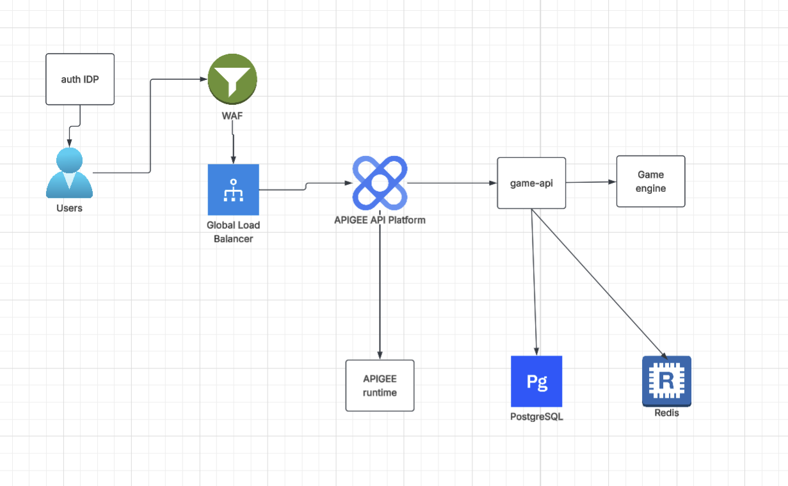

# savvy

Mock build for the Savvy Senior Engineer AI/technical exercise interview round, scheduled for Thu Aug 13th.

## Architecture

## User journey

1. **Sign-in**: user authenticates against Google Identity Platform/Firebase (from the frontend). Firebase issues a JWT (ID token) client-side — `game-api` never handles credentials directly.
2. **Request hits the API**: every call to `game-api` (via WAF → GLB → Apigee) carries that JWT as a Bearer token. `auth.py`'s `get_current_user` verifies it server-side with `firebase_auth.verify_id_token` — invalid/expired tokens get a 401 before any business logic runs.
3. **JIT user creation**: `game.py`'s `_get_or_create_user` looks the verified `firebase_uid` up in Postgres; if it's the user's first request, a `User` row is created on the spot (no separate signup flow — the DB record is lazily created on first authenticated call).
4. **Move submission** (`POST /api/move`): `game-api` calls `game-engine` over gRPC/HTTP internally (itself authenticated with a Google-signed ID token for service-to-service auth), gets back the computer's move and win/lose/tie result.
5. **Persist the result**: a `GameResult` row (player move, computer move, outcome) is written to Postgres, linked to the user — this is the durable system of record.
6. **Leaderboard in cache, not DB**: on a win, `cache.py` does a Redis `ZINCRBY` against a sorted set (`leaderboard:wins`) keyed by `firebase_uid`. `GET /api/leaderboard` reads straight from that Redis sorted set (`ZREVRANGE`) — it never queries/aggregates Postgres, avoiding DB load for a hot, frequently-read live ranking.
7. **History** (`GET /api/history`): reads the last 50 `GameResult` rows for the user straight from Postgres — this path *does* hit the DB, since it's per-user and not hot/shared like the leaderboard.

## Live-build window

Everything slow to provision (LB, cert, Apigee org, Postgres, Redis, etc.) is already up ahead of time. In the live-build window, 5 subagents do the parts that can't be pre-provisioned:

1. **add-trace-logging** — instruments `game-api`/`game-engine` with request-scoped trace-ID logging so one transaction can be followed end-to-end in Cloud Logging.
2. **deploy-cloud-run** — takes a built image and deploys it to the real Cloud Run service (swaps out the placeholder). Fed by `/build-push`, which builds and pushes the image first.
3. **apigee-proxy** — deploys the Apigee proxy bundle in front of `game-api` and wires the GLB to route through it (PSC NEG, hairpin rule, envgroup hostname fix).
4. **deploy-frontend** — builds and deploys the static sign-in/play UI to the GCS bucket already fronted by the LB.
5. **verify-transaction** — runs an actual end-to-end play through the stack and confirms, via logs (not just the HTTP response), that it really routed through Apigee with the trace ID intact.

## Skills (6)

| Skill | What it does |
|---|---|
| `build-push` | Builds a container image with a semantic version tag and pushes it to Artifact Registry |
| `list-infra` | Lists everything actually deployed in GCP right now, as a plain-English table (read-only) |
| `safe-pr` | Commits, pushes, and opens a PR, gated on a clean `tofu plan`, a cleartext-secret scan, and an intact `.gitignore` |
| `teardown` | Resets the app layer (Cloud Run image, Apigee proxy routing, local build artifacts) to a clean rehearsal baseline, without touching slow-to-provision infra or any Postgres/Redis data |
| `adr` | Generates an Architecture Decision Record for a feature or component decision |
| `threat-model` | Runs a structured security review of an endpoint, feature, or service boundary |

The first four are exercised in the live-build/demo loop; `adr` and `threat-model` are used situationally.

## Permissions (`.claude/settings.json`)

To keep the live-build session from stalling on approval prompts, `.claude/settings.json` allowlists a curated set of read-only `gcloud`/`tofu`/`git fetch` commands (`tofu plan`, `tofu fmt -check`, `tofu validate`, `gcloud * list`/`describe`, `gcloud logging read`, etc.) — derived from actual usage across past sessions, scoped narrowly per GCP resource group since some namespaces (`gcloud apigee apis`, `gcloud secrets versions`) mix safe verbs with mutating ones.

**Deliberately excluded, not just missed:**
- `tofu apply` and any `gcloud run deploy`-style write — the `deploy-cloud-run` and `apigee-proxy` subagents always show their plan and stop for an explicit go-ahead before touching real infra; this is a trust boundary baked into the agents themselves, not something a permission setting should paper over.
- `git push`/`commit`/`add`, `gh pr create` — repo-mutating actions.
- Any interpreter invocation (`python3 -c`, etc.) — allowlisting these is equivalent to allowing arbitrary code execution, regardless of how safe past invocations happened to be.
- `gcloud secrets versions access` — technically read-only, but exposes secret plaintext, so it stays a deliberate action rather than a background one.

## CI

A GitHub Actions workflow gates PRs touching `infra/`: `tofu fmt`/`tofu validate` for syntax and config correctness, plus a Gitleaks scan for exposed secrets.

## App layout (`app/`)

Three-tier app; the database tier lives in `infra/` as managed GCP services rather than in-repo:
- `frontend`
- `game-api`
- `game-engine`

## Infrastructure (`infra/`)

OpenTofu-managed, split into `main.tf` (root resources), `providers.tf` (backend + provider config), and reusable modules under `modules/` (`base-infra`, `security`). State lives remotely in a GCS bucket, not local files. Provisions:

- Enabled GCP APIs
- Private Services Access (PSA) connections
- PostgreSQL database (Cloud SQL)
- Redis cache (Memorystore)
- Secret Manager containers for secrets
- Cloud Router + Cloud NAT
- The Apigee organization and instance
- Artifact Registry
- Cloud Run placeholder services (hello-world image, swapped for real images at deploy time)
- Network Endpoint Groups (NEGs)
- WAF (Cloud Armor)
- GCS buckets (Tofu state + static frontend)
- Managed SSL certificate
- DNS
- Global load balancer
- Google Identity Platform (Firebase-backed auth)
